# Emotion Prediction with BlazeFace and TFLite Models

### Live Demo
See [Live Demo](https://shadji.github.io/emotionalanalysis/) here.

### Overview
This project demonstrates real-time emotion prediction by detecting faces using the BlazeFace model and predicting emotions using a TFLite model. The emotions are visualized by overlaying corresponding emoji icons on top of the video stream, and a dynamic bar graph is displayed below the video to show the relative probabilities of each emotion.

```mermaid
graph TB
    %% Define Subgraphs (User I/O, APP Logic, and AI Processing)
%% Outer Subgraph labeled "Edge Computing"
subgraph Edge_Computing [Edge]
    direction TB
    %% Define Subgraphs (User I/O, APP Logic, and AI Processing)
    subgraph AI_System [AI Models]
        direction TB
        C["🔧 Extract Face - BlazeFace"]
        D["😄 Predict - Emotional AI"]
    end
    subgraph User_IO [UI and App Logic]
        direction TB
        A["📹 User's Camera"]
        B["🔍 Capture Frame"]
        E["📊 Real-Time Emotion Feedback"]
        F["🖥️📱 User Interface"]
    end
      %% Define Flow Between Subgraphs
end




    %% Define Flow Between Subgraphs
    A -->|Video Feed| B -->|Video Frame| C -->|Face Image| D -->|Emotion Tensor| E -->|Emotion Result| F

    %% Style and Node Coloring
    %% Style and Node Coloring
    style Edge_Computing fill:#FFFFFF,stroke:#333,stroke-width:2px
    style User_IO fill:#FFF7C2,stroke:#333,stroke-width:2px
    style AI_System fill:#FFD4D4,stroke:#333,stroke-width:2px   
    style A fill:#f96,stroke:#333,stroke-width:2px
    style F fill:#ffc107,stroke:#333,stroke-width:2px
    style B fill:#6f9,stroke:#333,stroke-width:2px
    style E fill:#69f,stroke:#333,stroke-width:2px
    style C fill:#ffeb3b,stroke:#333,stroke-width:2px
    style D fill:#f36,stroke:#fff,stroke-width:2px

    %% Arrow styling for consistency
    linkStyle default stroke:#333,stroke-width:2px,fill:none

```


**Visualization of the emotional detection flow in this demo project: capturing video, detecting faces, predicting emotions, and displaying results in real time.**

## Features
- **Face Detection**: Uses the BlazeFace model to detect faces in the video stream.
- **Emotion Prediction**: Uses a TFLite model to classify emotions into four categories: Happy, Neutral, Sad, and Surprise.
- **Emoji Overlay**: Displays an emoji corresponding to the predicted emotion over the detected face.
- **Bar Graph Visualization**: A four-column bar graph shows the relative percentage of the predicted emotion classes in real-time.
- **Dynamic Updates**: Both the emoji and the bar graph update dynamically as predictions are made.

## Project Structure

- **index.html**: The main HTML file that includes the video stream, bar graph, and JavaScript logic for emotion prediction.
- **CSS Styling**: Basic CSS is used to style the layout, video stream, bar graph, and emoji overlays.
- **JavaScript Logic**: Includes the TensorFlow.js and TFLite libraries to handle the BlazeFace model and the custom TFLite model for emotion prediction.

## How to Run the Project

### Prerequisites

- A web browser that supports modern JavaScript features.
- An active internet connection to load TensorFlow.js and BlazeFace from the CDN.
- A webcam to capture live video for face detection and emotion prediction.

### Steps

1. **Download the Project Files**:
   ```
   git clone https://github.com/shadji/emotionalanalysis.git
   cd emotionalanalysis
   ```
2. **Start a Local Web Server**:
 
   - Using Python:
     ```
     python3 -m http.server
     ```
   - This will start a web server on `http://localhost:8000`. Open this URL in your browser.
3. **Watch in Action**: The webcam feed will be displayed on the page. Once the models are loaded, the face detection and emotion prediction will begin. An emoji will appear over your face, and a bar graph will update dynamically to show the relative confidence levels of the four emotion classes:
   - **Happy** (Green)
   - **Neutral** (Gray)
   - **Sad** (Red)
   - **Surprise** (Yellow)

### Project Files

- **index.html**: Contains the main HTML structure, styles, and scripts for the emotion detection and visualization.
- **TFLite Model**: A custom `.tflite` model named `emoji_4.tflite` is loaded via TensorFlow.js to predict the emotion. This model needs to be hosted and referenced in the `index.html` file.

### Example Code Snippets

#### BlazeFace Model Loading
```javascript
blazefaceModel = await blazeface.load(); // Load BlazeFace model
emojiModel = await tflite.loadTFLiteModel('emoji_4.tflite'); // Load your emoji TFLite model
```

#### Prediction and Bar Graph Update
```javascript
function updateBarGraph(predictionData) {
  for (let i = 0; i < 4; i++) {
    const bar = document.getElementById(`bar-${i}`);
    const percentage = predictionData[i] * 100; // Convert to percentage
    bar.style.height = `${percentage}%`;
  }
}
```

## Customization

- **Emotion Labels**: The four emotion classes are labeled as "Happy", "Neutral", "Sad", and "Surprise". You can customize these labels by modifying the labels in the `index.html` file.
- **Bar Graph Colors**: The colors for each emotion are green (Happy), gray (Neutral), red (Sad), and yellow (Surprise). These can be changed in the CSS section.
- **Prediction Model**: The TFLite model (`emoji_4.tflite`) can be replaced with a custom model if you'd like to predict different emotions.

## License
This project is for educational purposes. Feel free to customize and adapt it for your needs.